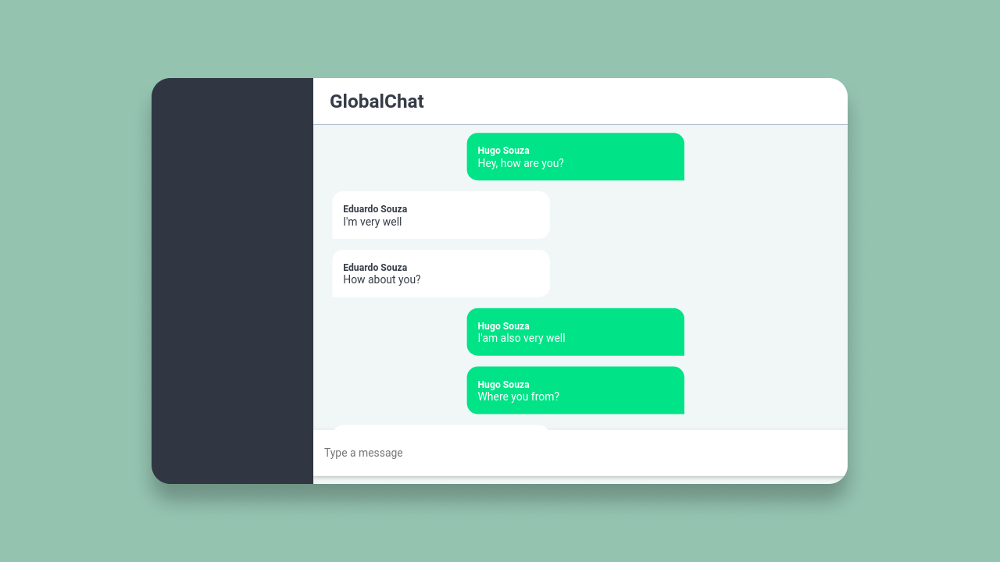

<h3 align="center">
  Chat Realtime
</h3>

<p align="center">
  
 
  
</p>

<p align="center">
  <a href="#about-the-project">About the project</a>&nbsp;&nbsp;&nbsp;|&nbsp;&nbsp;&nbsp;
  <a href="#technologies">Technologies</a>&nbsp;&nbsp;&nbsp;|&nbsp;&nbsp;&nbsp;
  <a href="#getting-started">Getting started</a>&nbsp;&nbsp;&nbsp;|&nbsp;&nbsp;&nbsp;
  <a href="#license">License</a>
</p>



## About the project

- This project is a simple, real-time global chat for people to communicate

## Technologies

Technologies I used to develop this system

- [Node.js](https://nodejs.org/en/)
- [ReactJS](https://reactjs.org/)
- [TypeScript](https://www.typescriptlang.org/)
- [Express](https://expressjs.com/pt-br/)
- [Styled Components](https://styled-components.com/)
- [SocketIO](https://socket.io/)

## Getting started

### Requirements

- [Node.js](https://nodejs.org/en/)
- [Yarn](https://classic.yarnpkg.com/) or [npm](https://www.npmjs.com/)

**Clone the project and access the folder**

```bash
$ git clone https://github.com/hugosrc/chat-realtime.git && cd chat-realtime
```

**Follow the steps below**

### Server

```bash
# Starting from the project root folder, go to server folder
$ cd server

# Install the dependencies
$ yarn

# To finish, run the api service
$ yarn dev:server

# Well done, project is started!
```

### Client

_Obs.: Before to continue, be sure to have the server running_

```bash
# Starting from the project root folder, go to client folder
$ cd client

# Install the dependencies
$ yarn

# Start the client
$ yarn start
```

## License

This project is licensed under the MIT License - see the [LICENSE](LICENSE) file for details.

---

Made by Hugo Souza 👋
